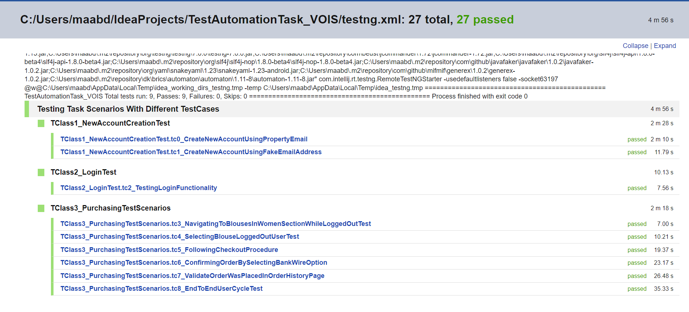

# TestAutomationTask_VOIS
 Testing high level scenarios on http://automationpractice.com/index.php e-commerce website using Selenium
 , TestNG by applying OOP and applying some of the best practices according to my current knowledge . 
 
# Task Requirements  :- 
1. Create a new account user (Bonus Task)
2. Select “Blouses” Subcategory in “Women” Category
3. Select resulted product
4. Follow checkout procedure
5. Confirm order by selecting bank wire option
6. Validate order was placed from order history page. 

- Using TestNG , DDT Way And a Design Pattern 

# Project Details :-
* Programming Language: Java Maven Project 
* IDE : Intellij
* Frameworks : Selenium 4.4 + TestNG 7.0.0 
* Data Driven Methodology : By Using Properties
* Number of Pages : 13
* Number Of Test Classes : 3 
* Number Of Test Cases : 9 
* Design Pattern : Fluent Page Object Model & Builder Pattern
* Browser : FireFox 
* Browser Resolution : 1024x768 px
* Waits : Explicitly/Fluent Waits 
* Challenges :- 
  * Reading Text Inside (br) Tag In The Confirmation Page . 
  * Splitting Order Confirmation Reference Code Text . 
* Solutions :- 
  * Using Searching And Solution Found By Using .getAttribute("InnerHTML") function to retrieve the text 
  * Reaching Sort of tutorials and accessing the documentation of getText methods .

# Sequential Execution Video 
# TestNG My Results

